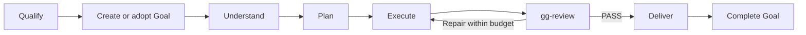

# gg stack

Ship substantial changes with review and proof.

- `gg-ship` — own substantial or high-risk build and ops work under a persistent Goal through verified delivery.
- `gg-review` — challenge the artifact and call blockers plainly.
- `gg-guardrails` — cut needless complexity, hidden risk, and flimsy evidence.

Built on the open [Agent Skills](https://agentskills.io) format.

## Install

```sh
npx skills add lilienblum/skills
```

## When to use gg-ship

Use `gg-ship` for major features spanning components, migrations, broad refactors, and long-running operational work. A high-risk change can qualify even when the edit is small. Multiple steps alone do not make a task substantial.

Handle light, low-risk fixes and routine edits directly with an appropriate check. They do not need this workflow or its review gate.

## How gg-ship works

For qualifying work, `gg-ship` creates or adopts a persistent Goal before planning. The Goal owns the durable outcome and status; the main agent owns the mutable plan, implementation, integration, and delivery. Delegate when independent work can usefully run in parallel or a concrete risk needs specialist attention.



One independent reviewer covers correctness, requirements, conventions, and simplicity. If the host cannot provide an independent reviewer, use and disclose a separate self-review. Repairs require an updated verdict, with checks repeated for affected behavior and earlier evidence reused only when it still applies.

`gg-guardrails` supplies shared criteria during planning and review without adding another verdict. `gg-review` and `gg-guardrails` also work on their own. Worker briefs and delivery formatting live with the workflows that use them.

Many independent units can add a rolling worker pool with a resumable manifest. Repeated transformations get a representative pilot before scaling. Long sequential work only needs the Goal and a compact execution checkpoint.
