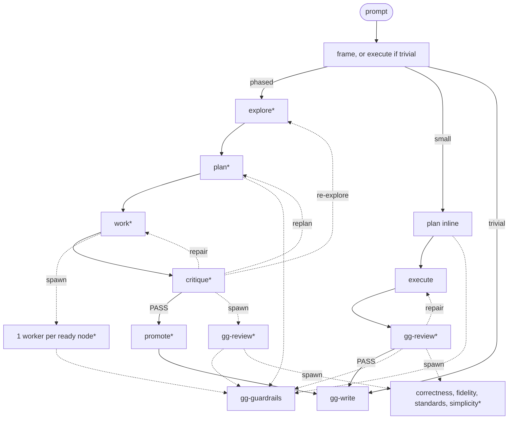

# gg stack

Hand off the work. Come back to proof.

- `gg-ship` — plan it, do it, review it, fix it, prove it.
- `gg-review` — challenge the artifact and call blockers plainly.
- `gg-guardrails` — cut needless complexity, hidden risk, and flimsy evidence.
- `gg-write` — tight briefs, sharp findings, no-drama receipts.

Built on the open [Agent Skills](https://agentskills.io) format.

## Install

```sh
npx skills add lilienblum/skills
```

## How they work

The first step frames the prompt, or executes it if trivial. Uncertain is small. Phase files and workers run only on the phased path. `gg-review` runs on small and phased. `*` is a subagent when the host can spawn one; otherwise a distinct pass on the main agent.



`work` fans out after a representative pilot. Large runs add a rolling fleet on the phased path. `gg-review` and `gg-write` also work on their own. The phase files live in `gg-ship`, not as extra skills.
